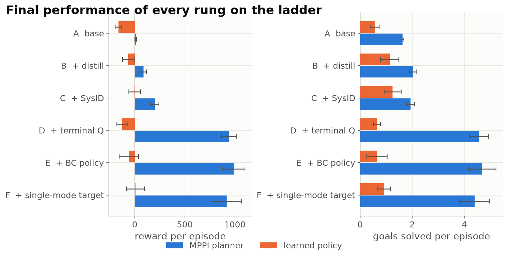

# TD-M(PC)² with a ComFree-Sim planner on the Allegro hand

This repository contains the code for a model-based RL agent for in-hand cube
reorientation with the Allegro hand. It follows TD-M(PC)², but the planner does
not use a learned world model. Instead it uses the ComFree-Sim analytic-contact
GPU simulator as its dynamics, and it identifies the simulator's 71 physical
parameters online. It also contains a TD-MPC2 baseline on the same task, and a
sim-to-sim evaluation in stock CPU MuJoCo.

Blog post: <https://tja72.github.io/tdmpc-comfree-allegro/>



## Repository layout

| folder | contents |
|---|---|
| [`comfree_tdmpc/`](comfree_tdmpc/) | The agent: vectorised Allegro environment on ComFree-Sim, batched MPPI planner, TD-M(PC)²-style policy/Q learning, online system identification, ablation scripts, and per-run results (`outputs/`). |
| [`tdmpc-square-pearl/`](tdmpc-square-pearl/) | Fork of the [TD-M(PC)²](https://github.com/DarthUtopian/tdmpc_square_public) codebase, with the `comfree-allegro-cube` task added. Used for the TD-MPC2 baseline. |
| [`sim2sim/`](sim2sim/) | Evaluates trained agents of both kinds in CPU MuJoCo (`mj_step`) on the same scene, parameters and task code. |
| [`comfree_warp/`](comfree_warp/) | **Upstream, unmodified.** [ComFree-Sim](https://github.com/asu-iris/comfree_warp), which vendors [MuJoCo Warp](https://github.com/google-deepmind/mujoco_warp). |
| [`envs/`](envs/) | Conda environment files for the two Python environments. |
| [`blogpost/`](blogpost/) | Source of the blog post (Quarto). |

## Installation

Requirements: Linux, an NVIDIA GPU with a CUDA 12.x-capable driver, and conda.
Everything runs on `cuda:0`; there is no CPU fallback. The code was run on an
RTX 3070, an RTX 4080 and an RTX 4090.

The project uses two environments, because the baseline needs older pins
(torch 2.3.1, torchrl/tensordict 0.4.0, `numpy<2`, `gymnasium==0.29.1`):

| env | used for |
|---|---|
| `comfree-tdmpc` | `comfree_tdmpc`: training, ablations, figures |
| `tdmpc-baseline` | `tdmpc-square-pearl` (TD-MPC2 baseline) and `sim2sim` |

```bash
git clone https://github.com/tja72/tdmpc-comfree-allegro.git
cd tdmpc-comfree-allegro

# comfree-tdmpc
conda env create -f envs/comfree-tdmpc.yml
conda activate comfree-tdmpc
pip install -e comfree_warp -e comfree_tdmpc

# tdmpc-baseline
conda env create -f envs/tdmpc-baseline.yml
conda activate tdmpc-baseline
pip install -e comfree_warp -e comfree_tdmpc
pip install -e tdmpc-square-pearl/tdmpc_square --no-deps
```

`warp-lang` is pinned to exactly 1.14.0 in both environments. The vendored
`mujoco_warp/_src/sensor.py` in `comfree_warp` reads an undefined variable in
`_frame_axis`. warp 1.14.0 compiles it, but warp 1.16 fails with
`WarpCodegenKeyError` when the first simulator is built. `comfree_warp` itself
only requires `warp-lang>=1.12`. `sim2sim` needs no installation; its scripts
add it to `sys.path`.

## Quickstart

The commands below assume the repository root as the starting directory and
`MUJOCO_GL=egl` for anything that renders. Runtimes are for one RTX 4090.

| step | env | command | time |
|---|---|---|---|
| Smoke test | `comfree-tdmpc` | `cd comfree_tdmpc && MUJOCO_GL=egl python scripts/00_smoke_test.py --nworlds 1 4` | ~1 min (first run compiles the Warp kernels) |
| Train one config (ablation rung D) | `comfree-tdmpc` | `cd comfree_tdmpc && MUJOCO_GL=egl python scripts/train_vec.py --name d_termq --out_root outputs/ablation --steps 150000 --distill --sysid --terminal_value` | ~1 h |
| Make figures | `comfree-tdmpc` | `cd comfree_tdmpc && python scripts/report/make_ablation_figures.py` | seconds |
| TD-MPC2 baseline | `tdmpc-baseline` | `cd tdmpc-square-pearl && python -m tdmpc_square.train task=comfree-allegro-cube model_size=5 steps=150000 seed=0 actor_mode=sac exp_name=sac_150k eval_value=false eval_episodes=16 eval_freq=5000 disable_wandb=true` | ~2 h |
| Sim2sim evaluation | `tdmpc-baseline` | `python sim2sim/scripts/evaluate.py --agent comfree_mpc --run comfree_tdmpc/outputs/ablation/d_termq --episodes 64` | depends on the agent (see `sim2sim/README.md`) |

The figure script works from the CSV/JSON files already in `outputs/`. The
sim2sim evaluation needs a trained checkpoint (`agent.pt`). Checkpoints are
not tracked in git. The ones used in the blog post are attached to the GitHub
release; put each `agent.pt` into its run directory under
`comfree_tdmpc/outputs/`.

Details for each part: [`comfree_tdmpc/README.md`](comfree_tdmpc/README.md),
[`tdmpc-square-pearl/README.md`](tdmpc-square-pearl/README.md),
[`sim2sim/README.md`](sim2sim/README.md).

## Reproducing the results

[`comfree_tdmpc/EXPERIMENTS.md`](comfree_tdmpc/EXPERIMENTS.md) lists every
experiment in the blog post with its exact command and output directory.
[`tdmpc-square-pearl/EXPERIMENTS.md`](tdmpc-square-pearl/EXPERIMENTS.md) does
the same for the baseline runs. Each run directory under
`comfree_tdmpc/outputs/` keeps `config.json`, `train.csv`, `eval.csv`,
`sysid.csv`, `params*.npy` and, where computed, `diagnosis.json`. Raw logs,
videos and checkpoints are not in the repository.

## Credits and licenses

This project builds on:

- **ComFree-Sim** (`comfree_warp/`): complementarity-free analytic contact
  model on GPU, [arXiv:2603.12185](https://arxiv.org/abs/2603.12185). Its
  `comfree_core/` is under the **ComFree Core Academic Research License**
  (noncommercial research use only, see `comfree_warp/comfree_warp/comfree_core/LICENSE`).
  The rest of `comfree_warp/` is covered by `comfree_warp/LICENSE` and
  `comfree_warp/LICENSES/`.
- **MuJoCo Warp** (vendored inside `comfree_warp/`), Apache-2.0.
- **MuJoCo** (Todorov et al., 2012), Apache-2.0.
- **TD-MPC2** (Hansen et al., 2024) and **TD-M(PC)²** (Lin et al., 2025,
  [arXiv:2502.03550](https://arxiv.org/abs/2502.03550)). The fork in
  `tdmpc-square-pearl/` keeps its MIT license (`tdmpc-square-pearl/LICENSE`).

The code in `comfree_tdmpc/` and `sim2sim/` is released under the MIT license
(`LICENSE`). It imports `comfree_core` at runtime, so running it is subject to
the noncommercial terms of the ComFree Core license.

This project was developed together with Jiayun Li.
